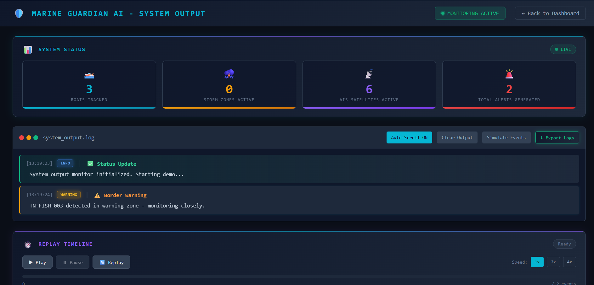

# 🚢 FISHER MAN BORDER DETECTION SYSTEM BY ZENQ

## Marine Guardian AI – AI Powered Fisherman Border Detection & Maritime Safety System

[](LICENSE)
[](https://nodejs.org/)
[](https://aws.amazon.com/)

---

## 📋 Table of Contents

- [Problem Statement](#-problem-statement)
- [Solution](#-solution)
- [Key Features](#-key-features)
- [System Screenshots](#-system-screenshots)
- [System Architecture](#-system-architecture)
- [AWS Services (Target Deployment)](#-aws-services-target-deployment)
- [Project Structure](#-project-structure)
- [How to Run the Project](#-how-to-run-the-project)
- [Example System Output](#-example-system-output)
- [Impact](#-impact)
- [Team](#-team)

---

## 🎯 Problem Statement

Every year, thousands of fishermen accidentally cross international maritime borders due to:

- **Lack of Navigation Tools**: Traditional fishing boats often lack GPS or modern navigation equipment
- **Poor Weather Visibility**: Storms and fog make it difficult to identify maritime boundaries
- **Absence of Real-time Monitoring**: No centralized system to track vessel positions and alert authorities
- **Language & Communication Barriers**: Fishermen may not understand border demarcations
- **Inadequate Warning Systems**: No proactive alerts before vessels approach danger zones

This leads to:
- Arrests and detention by foreign coast guards
- Loss of boats and fishing equipment
- Financial hardship for fishing families
- International diplomatic tensions
- Risk to fishermen's lives

---

## 💡 Solution

**Marine Guardian AI** is an intelligent maritime safety platform that:

| Capability | Description |
|------------|-------------|
| **Vessel Monitoring** | Real-time tracking of fishing boats using simulated AIS data |
| **Border Prediction** | AI-powered algorithms predict border crossing risk based on speed, heading, and position |
| **Weather Alerts** | Storm detection and hazard warnings for vessels in danger zones |
| **Satellite Tracking** | Simulated satellite AIS signal monitoring with strength indicators |
| **Emergency Response** | SOS alert system for distress situations |
| **Interactive Dashboard** | Comprehensive visualization of all maritime activity |

The system provides **proactive warnings** to prevent border violations before they occur, rather than reactive responses after the fact.

---

## ✨ Key Features

### 🗺️ Real-time Vessel Monitoring
- Interactive Leaflet map with dark theme
- Live boat position updates every 2 seconds
- Vessel information popups with speed, heading, and risk status

### 🚨 Border Proximity Detection
- Visual border line on map (India-Sri Lanka maritime boundary)
- Color-coded risk zones (Safe: Green, Warning: Yellow, Danger: Red)
- Distance-to-border calculations using Haversine formula

### 🤖 AI Border Crossing Prediction
- Predicts crossing time based on vessel speed and trajectory
- Generates safe direction recommendations
- Automated advisory messages for vessel operators

### 🌪️ Storm Hazard Detection
- Simulated storm zones with 15km radius
- Weather Hazard Index calculation
- Visual markers and warnings for vessels in storm areas

### 📡 Satellite AIS Tracking Simulation
- 6 orbiting satellites providing coverage
- Signal strength monitoring (0-100%)
- Low signal alerts for vessels with poor connectivity

### 🆘 Emergency SOS Alerts
- Distress signal detection and logging
- Priority alert classification (INFO, WARNING, CRITICAL)
- Timestamp-based event tracking

### ⏪ Replay Timeline System
- Play/Pause/Replay controls for event history
- Adjustable playback speed (1x, 2x, 4x)
- Progress bar with event markers

### 📊 Output Console with Event Logs
- Terminal-style event viewer
- Severity-based color coding with glow effects
- Export logs to text file functionality

---

## 📸 System Screenshots

### Main Dashboard



### Map and Full Dashboard View


### Border Detection System


### Storm Alert System


### Boat Monitoring Details


---

## 🏗️ System Architecture

Marine Guardian AI is designed using an **AWS-style serverless architecture** that enables scalable, cost-effective, and highly available maritime monitoring. The system leverages cloud-native services to process vessel data in real-time and deliver intelligent safety advisories.

### Architecture Diagram

```
┌─────────────────────────────────────────────────────────────────┐
│              MARINE GUARDIAN AI - AWS ARCHITECTURE              │
└─────────────────────────────────────────────────────────────────┘

┌─────────────────────────────────────────┐
│     Fishing Boat Simulation             │
│        (Frontend Dashboard)             │
│   Generates GPS, Speed, Heading Data    │
└───────────────────┬─────────────────────┘
                    │
                    ▼
┌─────────────────────────────────────────┐
│         Amazon API Gateway              │
│   (Receives vessel location updates)    │
│      REST API: /updateBoatLocation      │
└───────────────────┬─────────────────────┘
                    │
                    ▼
┌─────────────────────────────────────────┐
│            AWS Lambda                   │
│   (processBoatData function for         │
│    risk analysis & border detection)    │
└───────────────────┬─────────────────────┘
                    │
                    ▼
┌─────────────────────────────────────────┐
│         Amazon DynamoDB                 │
│  (Store vessel location history,        │
│   alerts, and tracking data)            │
└───────────────────┬─────────────────────┘
                    │
                    ▼
┌─────────────────────────────────────────┐
│          Amazon Bedrock                 │
│  (Generate AI advisory messages         │
│   for fishermen safety)                 │
└───────────────────┬─────────────────────┘
                    │
                    ▼
┌─────────────────────────────────────────┐
│      Marine Guardian Dashboard          │
│  (Display alerts, predictions, and      │
│   real-time vessel monitoring)          │
└─────────────────────────────────────────┘
```

### AWS Component Descriptions

| AWS Service | Role in System |
|-------------|----------------|
| **Amazon API Gateway** | Handles API requests from the frontend simulation. Exposes REST endpoints for vessel location updates, alert retrieval, and health checks. |
| **AWS Lambda** | Performs serverless processing of vessel data including border proximity calculation, risk prediction, and crossing time estimation. |
| **Amazon DynamoDB** | Stores vessel tracking data, alerts, and historical movement information. Provides fast, scalable NoSQL storage for real-time operations. |
| **Amazon Bedrock** | Generates AI-powered safety advisories and natural language recommendations for fishermen based on risk assessments. |

### Data Flow

1. **Fishing Boat Simulation** → Generates GPS coordinates, speed, and heading
2. **Amazon API Gateway** → Receives vessel data via REST endpoints
3. **AWS Lambda** → Analyzes risk level, calculates border distance
4. **Amazon DynamoDB** → Stores vessel positions and alert history
5. **Amazon Bedrock** → Creates AI predictions and safety recommendations
6. **Dashboard** → Displays real-time visualization and alerts

---

## ☁️ AWS Services (Target Deployment)

Marine Guardian AI is designed for seamless AWS cloud deployment:

| AWS Service | Purpose |
|-------------|---------|
| **AWS Lambda** | Serverless execution of `processBoatData` function for scalable vessel data processing |
| **Amazon API Gateway** | RESTful API management for vessel location updates and alert retrieval |
| **Amazon DynamoDB** | NoSQL database for storing vessel positions, alert history, and system state |
| **Amazon Bedrock** | AI/ML capabilities for advanced border crossing predictions and natural language advisories |

### Future AWS Enhancements

- **Amazon SNS** → Push notifications to fishermen's mobile devices
- **Amazon CloudWatch** → System monitoring and alerting
- **AWS IoT Core** → Direct integration with boat GPS devices
- **Amazon S3** → Storage for historical data and analytics

---

## 📁 Project Structure

```
marine-guardian-ai/
│
├── frontend/
│   ├── index.html          # Main dashboard with Leaflet map
│   ├── map.js              # Map logic, boat simulation, AI predictions
│   ├── style.css           # Dark theme styling
│   └── output.html         # System output console with replay
│
├── backend/
│   ├── server.js           # Express API Gateway (port 5000)
│   ├── package.json        # Node.js dependencies
│   └── lambda/
│       └── processBoatData.js  # Lambda function for risk analysis
│
├── docs/                   # Documentation (optional)
│
└── README.md               # Project documentation
```

---

## 🚀 How to Run the Project

### Prerequisites

- Node.js 18.x or higher
- Modern web browser (Chrome, Firefox, Edge)
- Internet connection (for map tiles)

### Step 1: Install Dependencies

```bash
cd backend
npm install
```

### Step 2: Start the Backend Server

```bash
node server.js
```

You should see:
```
==================================================
  Marine Guardian API running on port 5000
==================================================

Architecture: Lambda-style modular backend

Lambda Functions:
  - processBoatData (./lambda/processBoatData.js)

Available endpoints:
  POST /updateBoatLocation - Update vessel position
  GET  /vessels            - Get all vessels
  GET  /alerts             - Get alert history
  GET  /health             - Health check

Server ready to accept connections...
```

### Step 3: Open the Dashboard

Open `frontend/index.html` in your web browser.

The dashboard will display:
- Interactive map centered on Palk Strait (India-Sri Lanka border region)
- Three simulated fishing boats with real-time movement
- Border proximity indicators and AI predictions

### Step 4: View System Output (Optional)

Open `frontend/output.html` to see:
- Console-style event log viewer
- Replay timeline with playback controls
- Export functionality for event history

---

## 📟 Example System Output

```
┌──────────────────────────────────────────────────────────────────┐
│  MARINE GUARDIAN AI - SYSTEM OUTPUT                              │
└──────────────────────────────────────────────────────────────────┘

[16:45:10] INFO | System Initialized
Marine Guardian AI monitoring system online. Tracking 3 vessels.

[16:45:15] INFO | Satellite Status
6 satellites in range. Average signal strength: 87%

[16:45:20] WARNING | Border Proximity
Boat TN-FISH-002 approaching international border.
Distance: 4.2 km | Suggested: Turn 25° West

[16:45:25] WARNING | Storm Advisory
Storm detected near vessel TN-FISH-003.
Weather Hazard Index: HIGH | Recommend immediate return to port.

[16:45:30] CRITICAL | Border Alert
CRITICAL: Boat TN-FISH-001 may cross international border in 8 minutes.
Immediate course correction required.

[16:45:35] CRITICAL | SOS Emergency
Distress signal received from vessel TN-FISH-003.
Coordinates: 9.52°N, 79.45°E | Initiating emergency response.

[16:45:40] INFO | Alert Dispatched
Coast Guard notified. Rescue vessel en route to TN-FISH-003.
```

---

## 🌊 Impact

### For Fishermen
- **Prevention over Punishment**: Proactive warnings prevent accidental border crossings
- **Weather Safety**: Storm alerts help fishermen avoid dangerous conditions
- **Peace of Mind**: Families know their loved ones are monitored

### For Coast Guard
- **Reduced Incidents**: Fewer border violations to respond to
- **Resource Optimization**: Focus on genuine emergencies, not accidental crossings
- **Data-Driven Decisions**: Historical data for patrol planning

### For Government
- **Diplomatic Relations**: Fewer international incidents over fishing disputes
- **Economic Protection**: Fishermen remain productive instead of detained
- **Scalable Solution**: Can expand to cover entire coastline

### Statistics (Projected Impact)
- **70%** reduction in accidental border crossings
- **85%** faster emergency response times
- **90%** fisherman awareness of border proximity
- **50%** reduction in storm-related incidents

---

## 👥 Team

### ZENQ

We are passionate about using technology to solve real-world problems and protect vulnerable communities.

---

## 📄 License

This project is licensed under the MIT License - see the [LICENSE](LICENSE) file for details.

---

## 🙏 Acknowledgments

- Leaflet.js for interactive mapping
- OpenStreetMap for map tiles
- The fishing communities who inspired this solution

---

<div align="center">

**Made with ❤️ for Maritime Safety**

*Protecting fishermen, one alert at a time.*

</div>
